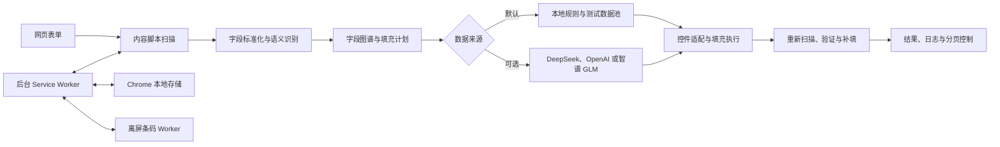

# FillForm

FillForm 是一款面向网页表单测试、回归验证和重复录入场景的 Chrome 扩展。它可以识别页面字段，按本地规则或云端模型生成测试数据，并自动完成文本、选择、日期、地址、文件等控件的填写；同时提供二维码与条形码识别、API 流程编排和 Hashids 编码/解码工具。

项目基于 WXT 构建，使用 Chrome Manifest V3。当前扩展版本为 `3.1.0`，默认使用本地启发式规则，不配置云端模型也可以完成主要的识别与填充流程。

## 最近更新（2026-09-09）

- 修复“数据加解”启用并保存后，刷新网页、设置页或重新加载扩展时状态丢失的问题。
- 修复旧设置页、模板中心保存时覆盖其他页面已保存配置或模板的问题。
- 修复解密项目勾选在进入编辑器、保存或取消后回退的问题。
- 修复切换数据来源、填写范围时，后台保存失败仍提示成功的问题。
- 修复流程模板中 `0 次重试`、`0 毫秒间隔`被错误恢复为默认值的问题。
- 修复富文本样本刷新后合并、多行 HTML 被拆分的问题，支持独立样本管理。
- 补充持久化回归测试，并同步更新可直接加载的 `extension/chrome-mv3` 扩展目录。

## 适用场景

- OA、后台管理系统、报名页、注册页等长表单的快速测试。
- 冒烟测试和回归测试中的批量字段填写。
- 多步骤表单的逐页填充与结果复核。
- Element UI、Arco Design 和自定义表单构建器页面的兼容性验证。
- 测试数据池、页面字段映射和接口流程模板的复用。
- 当前页面可视区域内二维码、Code 128、EAN 等条码的读取。

## 功能总览

### 表单识别

- 综合 `label`、`placeholder`、`name`、`id`、ARIA 属性、控件类型和页面上下文识别字段语义。
- 对扫描结果进行标准化、去噪、类型纠正、置信度评分和字段关系整理。
- 支持识别必填与非必填字段，并可选择“填写全部字段”或“只填写必填字段”。
- 支持整页识别、CSS 选择器限定区域，以及在页面中框选区域后填充。
- 支持手动补点遗漏字段、字段高亮和清除框选。
- 可按网址和路径保存字段映射，代码中保留了映射模板的保存、套用与迁移能力。

### 自动填充

- 一键完成字段扫描、数据生成、填充、重新扫描和结果验证。
- 支持普通输入框、文本域、富文本编辑器、原生下拉框、组合框、单选、多选、日期、时间、级联地址和文件上传。
- 对复杂组件优先模拟用户点击和选项选择，并触发必要的 `input`、`change` 等事件。
- 支持中国内地、香港和澳门手机号，身份证件、护照、企业信息、银行卡、地址等业务字段。
- 支持按页面提示生成中英文姓名、企业名称、职位、说明文本和项目描述。
- 填充完成后统计成功数、失败数和完成度，并在页面面板或扩展弹窗中展示执行日志。
- 支持取消正在进行的填充任务。

### 分页填充

- 可自动识别“下一步”“下一页”等页面动作，逐页扫描并填充。
- 对每一页记录识别、填充和验证结果，并汇总已处理页数。
- 内置循环检测、最大页数、下一页未切换和页面校验失败等保护。
- 遇到提交页、支付页或最终操作页时停止，不会自动提交表单。
- 分页填充默认关闭，需要在设置中心手动启用。

### 测试数据池

设置中心可以维护可复用的本地测试数据，自动填充时会优先从已启用的数据池取值：

- 中文姓名和英文姓名。
- 中国内地、香港、澳门手机号。
- 邮箱、固定电话和常用地址。
- 公司名称和统一社会信用代码。
- 中国内地身份证号、港澳台居民证号和护照号。
- 日期、时间、普通文本、数字和金额类数据。
- 中国境内银行卡号和香港银行卡号。
- 富文本内容，支持独立样本的新增、选择、删除，以及可视化编辑和多行 HTML 源码编辑。
- 文档、图片、视频、音频和压缩包等文件。

测试文件会转换为 Base64 并保存在 `chrome.storage.local`，填充文件控件时再恢复为浏览器 `File` 对象。建议只保存体积较小的测试文件，避免超过扩展本地存储配额。

### 本地规则与云端模型

FillForm 提供以下数据来源：

| 数据来源 | 说明 |
| --- | --- |
| `heuristic` | 默认模式。完全在本地根据字段类型、提示词和测试数据池生成内容，无需联网。 |
| `deepseek` | 调用 DeepSeek 的兼容接口生成字段值。 |
| `openai` | 调用 OpenAI 兼容的聊天补全接口，支持推理强度配置。 |
| `zhipu` | 调用智谱 GLM 接口，支持思考模式、推理强度和最大输出长度配置。 |

设置中心支持配置各提供方的 Base URL、模型名称和 API Key，并可以调整生成温度和测试连接。云端模型不可用或调用失败时，后台会回退到本地启发式规则，避免整个填充流程中断。

### 页面内控制中心

扩展提供多种操作入口：

- 浏览器工具栏弹窗：识别字段、一键填充、CSS 区域限定、字段列表、完成度和日志。
- 页面悬浮球：可拖动的快捷入口，点击后展开页面内控制面板。
- 页面内控制面板：数据来源切换、一键填充、选区填充、字段识别、手动补点、字段列表和效率统计。
- Chrome 侧边栏：复用工具栏弹窗能力，并绑定当前标签页。
- 设置中心：管理执行模式、面板标签、模型、测试数据和 Hashids 项目。
- 模板中心：管理页面字段映射和 API 流程模板。

默认只显示“界面面板”和“条码面板”。“API 面板”和“数据加解”需要在设置中心的“界面 Tab 控制”中启用，其中“数据加解”还需要通过密码验证。

密码验证通过后，点击“界面 Tab 控制”中的“保存”才会持久化启用状态。保存后刷新网页、重新打开设置中心或重新加载扩展都会保留；关闭并保存后，再次启用仍需验证密码。

设置页保存时只合并本页实际修改的字段，数据池开关只保存开关状态；模板中心也只保存本次新增、修改或删除的条目，避免旧页面覆盖其他页面已经保存的内容。

### 二维码与条形码识别

- “全局识别”会截取当前标签页的可视区域，并查找其中的多个条码。
- “截取识别”允许在页面中框选一个区域，适合定位单个二维码或条形码。
- 二维码优先使用 `jsQR` 在本地解析。
- 一维码优先使用浏览器原生 `BarcodeDetector`，不可用或未识别时回退到离屏文档中的 `zxing-wasm` Worker。
- 支持 QR Code、Codabar、Code 39、Code 93、Code 128、EAN-8、EAN-13、ITF、ITF-14、UPC-A 和 UPC-E。
- 识别结果包含内容、格式和预览，并支持复制结果。

条码功能读取的是当前标签页可视区域截图，不使用摄像头，也不会自动滚动并扫描整个网页。

### API 接口与流程模板

启用“API 面板”后，可以在页面内完成接口保存、流程编排和测试执行：

- 粘贴并解析 cURL 命令，提取请求地址、方法、请求头和请求体。
- 为接口设置名称、项目、环境和变量来源。
- 将已保存接口组合成多步骤流程模板。
- 按项目和开发、测试、预发、生产环境筛选接口与流程。
- 支持本地 Mock 或大模型生成模板变量。
- 支持循环次数、执行间隔和单步骤失败重试。
- 后台执行器支持把步骤响应合并到后续步骤上下文，并读取模板中已有的响应提取规则；当前界面暂未提供逐字段配置提取规则的编辑器。
- 独立模板中心支持页面模板统计、应用和删除，也支持接口保存、流程步骤编排、排序、加载、删除、循环执行和日志查看。

页面内 API 面板当前不能强制中断已经发出的网络请求；停止操作会在步骤或轮次之间生效。

### Hashids 编码与解码

- 可以维护多个项目，每个项目包含名称、Salt 和最小长度。
- 页面内“数据加解”面板支持选择项目、编码、解码和复制结果。
- 提供固定配置、往返转换、参考实现和错误输入校验脚本。

Hashids 是可逆的标识符编码方案，不是密码学加密。不要使用它保护密码、令牌或其他真正的敏感数据。

## 支持的字段与组件

| 类别 | 主要类型 |
| --- | --- |
| 基础文本 | 普通文本、文本域、富文本、姓名、邮箱、验证码、职位和说明文本 |
| 企业信息 | 公司名称、企业编号、登记号和统一社会信用代码 |
| 联系方式 | 中国内地、香港、澳门手机号，固定电话和地址 |
| 身份证件 | 中国内地身份证、港澳台居民证和护照 |
| 数值信息 | 普通数字、人数、百分比、金额和银行卡号 |
| 日期时间 | 原生日期、日期选择器、时间选择器和组合日期时间控件 |
| 选择控件 | 原生下拉框、组合框、级联选择、单选组和复选组 |
| 地址控件 | 省市区级联、香港地区级联、街道地址和地址详情 |
| 文件控件 | 文档、图片、视频、音频、压缩包及其他文件上传 |

当前内置适配层包括：

- 原生 HTML 和常见 ARIA 控件。
- Element UI 的下拉、级联、树选择、日期时间、上传、穿梭框、数字输入、开关、滑块、评分、颜色、自动完成、提及、单选和复选组件。
- Arco Design 的对应组件以及验证码组件。
- 项目内 `.fb-*` 自定义表单渲染器的级联、排序、评分、NPS、富文本和时间控件。

其他组件库仍可能通过通用 DOM 和 ARIA 规则被识别；复杂自定义控件可以通过新增适配器或手动补点扩展。

## 典型使用流程

1. 在设置中心确认执行模式为 `content`，数据来源为默认的 `heuristic`。
2. 按需维护姓名、电话、邮箱、证件、地址和文件等测试数据。
3. 打开需要测试的网页，通过工具栏弹窗或页面悬浮球进入控制中心。
4. 点击“识别字段”，检查字段数量、类型和高亮结果。
5. 如有遗漏，使用“手动补点”；如只需填写局部区域，使用选区填充或 CSS 选择器。
6. 点击“一键智能填充”，查看成功数、失败数、完成度和执行日志。
7. 多页表单可在设置中启用分页填充；最终提交仍由测试人员手动确认。

## 工作原理



主要执行链路如下：

1. 内容脚本在 `document_idle` 阶段注入页面并扫描候选控件。
2. 识别引擎清理噪声字段、纠正字段类型、计算置信度并建立字段关系。
3. 后台应用当前网址的字段映射和设置，生成待填充字段计划。
4. 本地数据引擎或云端模型生成字段值。
5. 填充引擎通过原生或组件适配器操作页面控件。
6. 填充后重新扫描并验证结果，必要时进行补填。
7. 分页模式继续识别下一页动作，直到安全停止条件触发。

## 项目结构

```text
FillForm/
├─ entrypoints/                  WXT 编译入口
│  ├─ background.ts             引入并启动当前后台运行时
│  ├─ barcode-offscreen-client.js
│  └─ barcode-offscreen/        离屏条码页面与 Worker 调度
├─ legacy/                       当前仍在使用的后台运行时源码
│  ├─ background.js             消息路由、存储、识别、填充、分页、模板和条码编排
│  ├─ barcodeOffscreenClient.js 离屏文档通信、超时和恢复
│  ├─ barcodeZxingWorker.js     ZXing WASM 条码解码 Worker
│  ├─ core/                     后台使用的数据、模型、字段和模板模块
│  └─ templates/                后台模板兼容模块
├─ public/                       构建时原样复制到扩展产物的运行时资源
│  ├─ adapters/                 原生、Element UI、Arco 和自定义控件适配器
│  ├─ content/                  页面扫描、填充和悬浮控制面板
│  ├─ core/                     字段类型、识别、数据、模型、模板和工具模块
│  ├─ templates/                模板兼容入口
│  ├─ icons/                    扩展图标
│  ├─ popup.*                   浏览器工具栏弹窗
│  ├─ options.*                 设置中心
│  ├─ sidepanel.*               Chrome 侧边栏
│  ├─ template-center.*         独立模板中心
│  └─ ui/overlay.css            页面内悬浮球和控制面板样式
├─ scripts/                      Hashids、条码和表单识别检查脚本
├─ wxt.config.ts                 Manifest、权限和内容脚本配置
├─ package.json                  依赖与常用命令
└─ tsconfig.json                 TypeScript 严格模式配置
```

`legacy/` 不是废弃或仅备份目录。`entrypoints/background.ts` 会直接导入其中的 `background.js`，因此它仍是当前后台 Service Worker 的核心运行时代码。

## 关键模块

| 模块 | 职责 |
| --- | --- |
| `public/content/scan.js` | 扫描 DOM、收集标签与定位信息、识别复杂控件和地址结构。 |
| `public/core/detectEngine.js` | 类型推断、置信度评分、字段纠正、噪声过滤和地址组件提升。 |
| `public/core/fieldGraph.js` | 标准化字段并构建字段关系和摘要。 |
| `public/core/dataEngine.js` | 管理测试数据池，并按语义、地区和规则生成字段值。 |
| `public/core/llmAdapter.js` | 构建模型请求、分批生成字段值和测试模型连接。 |
| `public/content/fill.js` | 定位控件、执行填充、校验结果和处理复杂组件。 |
| `public/content/agent.js` | 页面内控制中心、手动补点、条码、API 和数据加解交互。 |
| `legacy/background.js` | 统一消息路由、配置存储、任务编排、分页填充、模板和条码处理。 |
| `public/core/templateEngine.js` | cURL 解析、变量插值、请求构建和 API 模板执行。 |

## 运行

项目使用当前设备的 Node.js 与 npm 默认缓存目录，macOS、Windows 和 Linux 均可使用相同命令。

```bash
npm install
npm run dev
```

生产构建：

```bash
npm run build
```

构建完成后会同时刷新仓库中的 `extension\chrome-mv3`。该目录会提交到 Git，其他设备 clone 或 pull 后无需安装依赖和重新构建，直接在 `chrome://extensions` 中加载即可。

## 常用命令

| 命令 | 作用 |
| --- | --- |
| `npm run dev` | 启动 WXT 开发模式。 |
| `npm run build` | 构建 Chrome Manifest V3 生产产物，并同步可提交的 `extension/chrome-mv3`。 |
| `npm run check:hashids` | 校验内置 Hashids 项目的编码、解码和异常输入。 |
| `npm run check:background-settings` | 校验后台读取、保存及扩展初始化时保留数据加解 Tab 配置。 |
| `npm run check:options-tabs` | 使用本机 Chrome 和隔离测试存储，校验设置页刷新、保存及密码入口行为。 |
| `npm run check:persistence` | 校验配置合并、模板存取、项目勾选、富文本样本、保存失败及零值恢复；浏览器部分使用隔离 Chrome 和模拟存储/响应。 |
| `npm run zip` | 打包扩展压缩包。 |

项目当前没有统一的 `npm test` 命令。以下脚本需要按各自前置条件单独运行：

- `scripts/check-barcode-offscreen-client.mjs`：使用 Node.js 模拟 Chrome API，检查离屏条码客户端的创建、重试、恢复和错误处理。
- `scripts/check-barcode-regression.mjs`：依赖已构建产物和本机 Chrome，检查二维码、Code 128、Worker 以及主次产物资源一致性。
- `scripts/check-form-recognition.mjs`：依赖已构建产物和可访问的测试页面，使用无头 Chrome 检查字段识别与可选填充，并输出 JSON 和截图。
- `scripts/patch-secondary-mv3-output.mjs`：用于修补已有的次级 MV3 产物，不会随 `npm run build` 自动执行。

## 加载扩展

1. clone 或 pull 仓库；开发者修改源码后执行 `npm run build` 刷新扩展目录。
2. 打开 `chrome://extensions`。
3. 开启右上角“开发者模式”。
4. 点击“加载已解压的扩展程序”。
5. 选择仓库中的 `extension\chrome-mv3`。
6. 打开普通网页，点击工具栏中的 FillForm 图标，或使用页面右侧悬浮球。

Chrome 内置页面、Chrome 扩展商店和其他禁止内容脚本注入的页面不能使用表单识别与填充。

## 权限说明

扩展当前申请以下权限：

| 权限 | 用途 |
| --- | --- |
| `activeTab` | 操作当前活动标签页。 |
| `scripting` | 注入或调用页面脚本。 |
| `tabs` | 查询标签页、读取当前页面信息和协调任务。 |
| `storage` | 保存设置、测试数据、模板、字段映射和文件。 |
| `sidePanel` | 打开 Chrome 侧边栏控制界面。 |
| `offscreen` | 在离屏文档中运行 ZXing WASM 条码 Worker。 |
| `<all_urls>` | 在任意普通网页中识别和填充表单，并允许 API 模板访问目标地址。 |

条码识别需要截取当前标签页可视区域。WASM 解码需要 Manifest 内容安全策略中的 `wasm-unsafe-eval`。

## 数据与安全

- 设置、API Key、测试数据、字段映射、模板和测试文件保存在扩展的 `chrome.storage.local` 中，不会自动同步到其他设备。
- `chrome.storage.local` 不是加密保险箱。不要在共享浏览器配置中保存生产密钥或真实个人数据。
- 使用云端模型时，字段描述和候选信息会发送到所配置的模型接口，请确认目标环境的数据合规要求。
- API 模板会按保存的地址和内容真正发出网络请求，执行前应确认环境和请求参数，特别是生产环境。
- 默认测试数据只用于开发和测试，使用前应替换任何不适合当前项目的示例内容。
- Hashids 只能用于可逆编码，不能替代密码学加密或权限控制。
- “数据加解”的界面密码属于前端入口保护，不应作为强安全边界。

## 当前状态与边界

- 当前可用执行模式为 `content`；设置中的 `cdp` 模式仍处于实验状态并被禁用。
- 默认数据来源为本地 `heuristic`，云端模型是可选增强能力。
- 设置中心默认显示“基础配置”“模型管理”和“数据策略”。
- 高级 Mock 规则、手动字段库、模板工作台和调试工具的设置页入口目前被注释隐藏，但相关底层代码仍保留。
- 页面内的页面模板选择、套用和保存入口目前被注释隐藏；独立模板中心和相关存储逻辑仍在代码中。
- “API 面板”和“数据加解”默认不显示，需要在设置中心启用。
- 条码识别只处理当前标签页可视区域或框选区域，不提供摄像头扫码和整页滚动扫描。
- 分页填充不会点击最终提交或支付按钮。
- 项目面向 Chrome Manifest V3，未承诺 Firefox、Safari 或其他浏览器兼容性。
